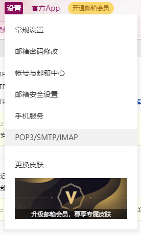
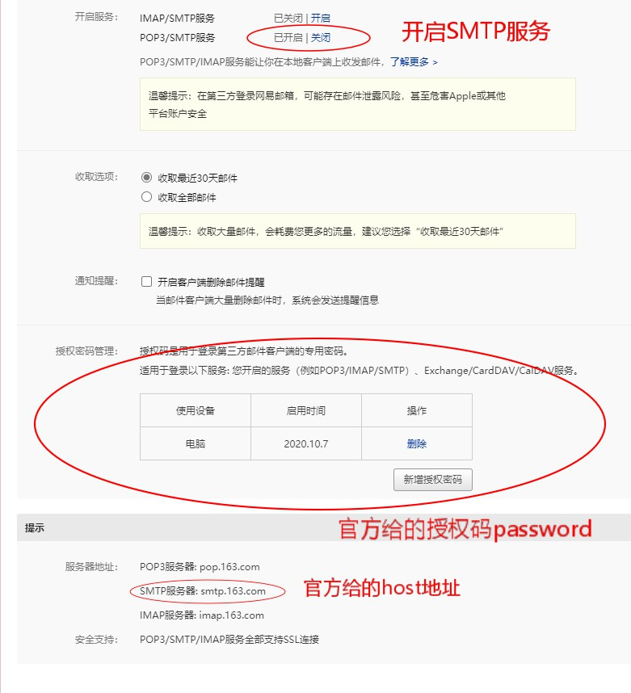
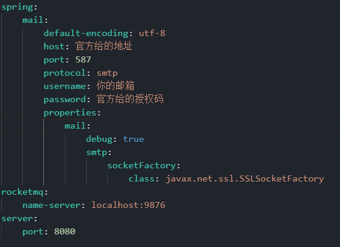

# 项目简介

​	BugnoLwy-SYS是基于Spring Boot + Mybatis-Plus构建的一套后台管理权限系统，mail是普通单体项目，sys是单体聚合项目，前端采用了Bootstrap框架进行构建，加入了zTree树插件，并使用SpringThymeleaf进行渲染

* 项目目前只开发了日志管理，用户管理，角色管理，菜单管理，部门管理模块

# 演示地址

[http://121.37.137.86/](http://121.37.137.86/)	或者直接输入  [http://121.37.137.86/login](http://121.37.137.86/login/)

# 体验帐号

test1		123

test2		123

test3		123

test4		123

test5		123

# 技术选型

​	JDK1.8 + MySQL + Maven + SpringBoot2.2.10 + SpringCloudAlibaba2.2.3 + Mybatis-Plus SpringSecurity + SpringSession + SpringFox(swagger)3.0 + Redis +  RocketMQ + SpringMail + Nacos + Flyway + Bootstrap + zTree + SpringThymeleaf + Nginx

# 项目说明

* 项目采用Springboot + Mybatis-Plus，boot使用简单，并且可以通过yaml进行简单配置，提高了开发效率；MP使用简单且功能强大，使用代码即可轻松实现单表CRUD，降低了开发难度（本来想用轻代码Diboot进行数据持久化的，未来可能会发布）

* 项目在获取list资源时使用stream流获取，能够更快的获取到需要的资源；使用自定义断言进行数据校验，使用自定义注解 + AOP获取用户操作并保存至日志，在Security配置类里使用了Lambada表达式（可能会使代码的可读性降低）

* 项目使用Redis缓存对象数据以及Security权限认证数据，SpringSession + Redis 将Session存入Redis里，实现Session共享

* 项目使用RocketMQ进行消息生产及消费，新增用户在填写邮箱保存后会使用SpirngMail发送该用户的账号密码邮件至填写的邮箱

* 项目使用Nacos作为服务注册和配置中心，因为项目部署于华为云服务器，所以希望能及时看到服务状态，并且Nacos可以动态修改一些yaml配置。我个人非常喜欢Nacos，同时也希望SpringAlibaba微服务体系能越做越好

* 项目使用SpringFox作为接口注释使用，如果需要接口测试可以使用swagger的ui界面进行测试

* 前端采用Bootstrap（Bootstrap模版地址：[Free Bootstrap Admin Template | AdminLTE.IO](https://adminlte.io/)）模版进行构建，使用Thymeleaf进行渲染，使用zTree树插件将数据呈树状结构进行选择

* 项目采用Nginx作为网关进行路由转发（本来想用Nginx来进行负载均衡，可是用的是个人用户免费体验的服务器，内存不够）

# 项目部署

项目使用Flyway进行简化部署，只需要准备一个空的bugnolwy数据库和一个Redis即可轻松启动sys项目

项目如果部署在本地在开启项目后输入: [http:localhost:8081/login](http:localhost:8081/login)

项目默认帐号：admin	密码：123456

## 使用mail

首先你需要在你的邮箱申请开启SMTP服务（以网易邮箱为例）：

进入SMTP界面里

开启后将官方给的host地址和你的邮箱名以及官方授权码写到mail的yml文件

即可在mail的Test文件下进行测试体验

## 使用RocketMQ

mq的依赖默认注释掉了，如果需要开启请先开启RocketMQ再将依赖注释去掉以及SysUserService的注释去掉即可

## 使用Nacos

Nacos的依赖默认注释掉了，如果需要开启请先开启Nacos再将依赖注释去掉以及启动类的注释去掉即可

## 忘记密码

可以在sys-web下的test文件进行密码加密

# 项目问题

对于项目有任何问题可以通过邮箱lwylwy777777@163.com联系我，我会尽快给予解决，项目只可用于学习与交流，如需商业化用途请发送邮件联系